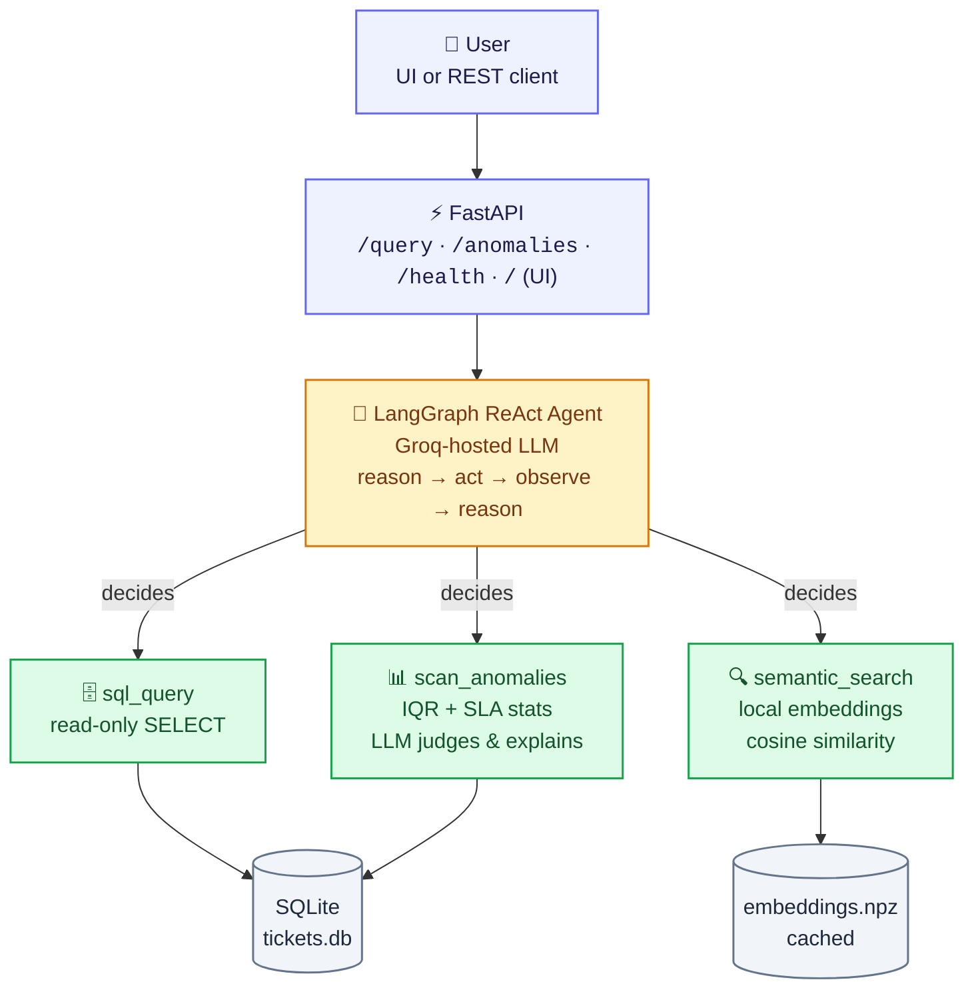

# 🎧 Support Ticket Intelligence — Agentic AI System

> An LLM agent that **decides its own tools** — SQL, statistical anomaly detection, or semantic search — to answer natural-language questions over a customer support ticket dataset. No hardcoded intent router; the reasoning loop is the router.

[](https://www.python.org/)
[](https://fastapi.tiangolo.com/)
[](https://www.langchain.com/langgraph)
[-F55036)](https://console.groq.com)
[](#license)

---

## Table of contents

- [Why this exists](#why-this-exists)
- [Architecture](#architecture)
- [Design decisions](#design-decisions)
- [Quickstart](#quickstart)
- [Configuration](#configuration)
- [REST API](#rest-api)
- [Example interactions](#example-interactions)
- [Performance & reliability engineering](#performance--reliability-engineering)
- [Dataset](#dataset)
- [Project structure](#project-structure)
- [Known limitations](#known-limitations)
- [Roadmap](#roadmap)
- [License](#license)

---

## Why this exists

Most "AI support dashboards" are a thin LLM wrapper around a fixed set of `if/elif` intents. This project instead gives an LLM agent a small, well-described **tool belt** and lets it plan multi-step tool calls itself — reasoning about *which* tool a question needs, observing the result, and optionally chaining a second tool call before answering. It's built to run **entirely on free infrastructure** (Groq's free LLM tier + local embeddings, no vector DB service, no paid API), start with a single command, and stay auditable: every statistic the agent reports is computed by deterministic code, never hallucinated arithmetic.

## Architecture



**The agent, not application code, decides tool selection.** [`app/agent/graph.py`](app/agent/graph.py) builds a LangGraph `create_react_agent` with a system prompt describing the three tools below; the LLM chooses, calls, observes results, and may call a second tool before answering — e.g. `semantic_search` to find matching tickets, then `sql_query` to compute a stat about them.

| Tool | File | Purpose |
|---|---|---|
| `sql_query` | [`app/agent/tools.py`](app/agent/tools.py) | Read-only `SELECT` against the `tickets` SQLite table — counts, averages, filters, group-bys, rankings |
| `scan_anomalies` | [`app/agent/anomaly_engine.py`](app/agent/anomaly_engine.py) | Runs IQR/SLA statistics, hands the agent candidates to review and explain |
| `semantic_search` | [`app/rag/embed_store.py`](app/rag/embed_store.py) | Cosine similarity over local sentence-transformer embeddings for fuzzy, meaning-based queries |

## Design decisions

| Choice | Reasoning |
|---|---|
| **LangGraph ReAct agent** | Real multi-step, LLM-driven tool selection with observation/retry, not a keyword router. Industry-standard, well-supported pattern. |
| **Groq (`llama-3.3-70b-versatile`)** | Free tier, no credit card, very fast — matters because an agentic loop can take 2–4 LLM round trips per question. |
| **SQLite for structured queries** | LLMs are excellent at writing SQL and bad at doing arithmetic themselves. SQL composes filters + aggregations + group-bys far better than hand-rolled pandas-from-NL. The tool permits only `SELECT` (regex-enforced, single statement), so a miswritten or adversarial query can't mutate data. |
| **Local sentence-transformers embeddings + numpy cosine search** | 500 short text rows don't need a vector DB service. A cached in-memory matrix gives genuine semantic retrieval at zero cost and zero extra infrastructure; swapping in Chroma/FAISS later is a one-file change. |
| **Statistics-first anomaly detection, LLM-second** | A pure LLM scan of 500 rows is unreliable and can't do rigorous math. A pure fixed-threshold script can't explain itself or use judgement. `anomaly_engine.py` computes **candidates** (per-category IQR outliers on resolution time, SLA breaches for urgent+open tickets past 24h, low-rating agent clusters) and hands them to the agent, which decides what's genuinely worth flagging and writes the explanation. |
| **FastAPI serving both REST + UI** | One process, one command (`uvicorn app.api.main:app`) satisfies "REST API *and* minimal UI" without extra orchestration. |

## Quickstart

### Prerequisites

- Python 3.10+
- A free [Groq API key](https://console.groq.com) (no credit card required)

### Linux / macOS / Git Bash

```bash
git clone https://github.com/ro-hit-10/Customer-Support.git
cd Customer-Support
cp .env.example .env
# edit .env and paste your GROQ_API_KEY

./run.sh
```

### Windows (PowerShell)

```powershell
git clone https://github.com/ro-hit-10/Customer-Support.git
cd Customer-Support
Copy-Item .env.example .env
# edit .env and paste your GROQ_API_KEY

python -m venv .venv
.\.venv\Scripts\Activate.ps1
pip install -r requirements.txt
uvicorn app.api.main:app --host 0.0.0.0 --port 8000
```

Then open:

- **http://localhost:8000** — minimal chat + anomaly-report UI
- **http://localhost:8000/docs** — interactive Swagger API docs

On first startup the app automatically:

1. Loads `data/support_tickets.csv` into `data/tickets.db` (SQLite).
2. Builds sentence embeddings for `issue_summary` and caches them to `data/embeddings.npz` (subsequent restarts load the cache instantly).

No separate ingestion step is required — this is the single-command entry point.

## Configuration

All tunables live in `.env` (copy from `.env.example`); nothing needs code changes to reconfigure.

| Variable | Default | Description |
|---|---|---|
| `GROQ_API_KEY` | — | **Required.** Free key from [console.groq.com](https://console.groq.com) |
| `GROQ_MODEL` | `llama-3.3-70b-versatile` | Groq-hosted model used for the agent loop |
| `LLM_TEMPERATURE` | `0.1` | Sampling temperature — kept low for consistent tool-calling and arithmetic-adjacent answers |
| `SLA_BREACH_HOURS` | `24` | Hours past which an open/urgent ticket is treated as an SLA breach candidate |
| `IQR_MULTIPLIER` | `1.5` | IQR multiplier used for per-category resolution-time outlier detection |

## REST API

| Endpoint | Method | Purpose |
|---|---|---|
| `/health` | `GET` | Liveness + config check (row count loaded, LLM key present) |
| `/query` | `POST` | Natural-language Q&A; agent picks tools autonomously |
| `/anomalies` | `POST` | Agent-reviewed anomaly scan; returns both narrative and raw statistical candidates |

<details>
<summary><strong>POST /query</strong> — request / response</summary>

```jsonc
// Request
{
  "question": "How many critical tickets are unresolved?",
  "session_id": "optional-conversation-id"
}

// Response
{
  "answer": "There are 19 Critical-priority tickets that are still Open or Escalated.",
  "tool_calls": ["sql_query"]
}
```
</details>

<details>
<summary><strong>POST /anomalies</strong> — response</summary>

```jsonc
{
  "summary": "3 items worth flagging: TKT-233 (Billing, High priority) has been open ~988 days past SLA — looks like a stale/orphaned ticket rather than a genuine active breach...",
  "candidates": {
    "sla_breaches": [ /* ... */ ],
    "resolution_outliers": [ /* ... */ ],
    "low_rating_clusters": [ /* ... */ ]
  }
}
```
</details>

<details>
<summary><strong>GET /health</strong> — response</summary>

```jsonc
{
  "status": "ok",
  "rows_loaded": 500,
  "llm_configured": true
}
```
</details>

## Example interactions

```
POST /query {"question": "How many critical tickets are unresolved?"}
→ tool_calls: [sql_query]
→ "There are 19 Critical-priority tickets that are still Open or Escalated."

POST /query {"question": "Which agent has the lowest average customer rating?"}
→ tool_calls: [sql_query]
→ "AGT-07 has the lowest average customer rating at 2.8 across 34 rated tickets."

POST /anomalies
→ tool_calls: [scan_anomalies]
→ "3 items worth flagging: TKT-233 (Billing, High priority) has been open
   ~988 days past SLA — looks like a stale/orphaned ticket rather than a
   genuine active breach, worth auditing. TKT-108 took 119.7 hrs to resolve
   vs a ~12 hr median for General tickets and got a 2-star rating — likely
   a real service failure. No agent currently shows a low-rating cluster."

POST /query {"question": "Find tickets similar to a login failure"}
→ tool_calls: [semantic_search]
→ Returns top-5 tickets by semantic similarity to "login failure",
  even ones that don't contain the literal words "login" or "failure".
```

Exact numbers/wording will vary run to run since the LLM writes the final prose — the tool calls and underlying data are deterministic.

## Performance & reliability engineering

| Optimization | Why |
|---|---|
| **In-process TTL cache on `load_dataframe()`** ([`app/utils/cache.py`](app/utils/cache.py)) | The 500-row table doesn't change between requests; repeated SQLite round-trips were pure waste. Keyed on the DB file's mtime, so a re-ingest busts it automatically — no stale-data risk. |
| **15s cache on anomaly candidates** | Dedupes bursts (e.g. the UI's chat tab and anomaly tab both scanning within seconds) without the SLA "age" figures ever going meaningfully stale. |
| **Single shared, cached anomaly-candidate function** | `/anomalies` used to run the full IQR/SLA statistics pass twice per request — once inside the agent's `scan_anomalies` tool call, once again directly for the "raw candidates" field. Both call sites now go through one cached function (`tools.get_anomaly_candidates`), so the endpoint's raw data is guaranteed to be exactly what the agent reasoned over, computed once. |
| **120s cache on final agent answers**, keyed by `(question, session_id)` | The highest-leverage cache in the system — a hit skips an entire multi-step LLM tool-calling loop. Saves both latency and free-tier quota on repeated/duplicate questions. |
| **Async end-to-end** (`agent.ainvoke`, `async def` routes) | The dominant cost per request is network I/O waiting on Groq, not local CPU — async lets FastAPI serve other requests while one is in flight. |
| **Retry with jittered exponential backoff on the LLM call** | Free-tier APIs rate-limit. A transient 429/503 is retried (1s → ~2s → ~4s) instead of surfacing as a hard failure. Non-transient errors (bad request, auth) still fail fast. |
| **Embedding model warm-loaded at startup**, not lazily on first query | The ~1–2s sentence-transformers model load happens once at server startup, so the first real `semantic_search` call never pays that latency spike. |
| **SQL tool restricted to single read-only `SELECT`, 200-row cap** | Keeps LLM-generated queries safe and keeps tool output small enough to stay cheap in the LLM's context window. |

## Dataset

`data/support_tickets.csv` — 500 rows, 10 columns:

| Column | Type | Description |
|---|---|---|
| `ticket_id` | string | Unique ticket identifier (`TKT-###`) |
| `created_at` | datetime | Ticket creation timestamp |
| `category` | string | e.g. `Billing`, `General`, `Technical` |
| `priority` | string | `Low` / `Medium` / `High` / `Critical` |
| `status` | string | `Open` / `Resolved` / `Escalated` |
| `response_time_hrs` | float | Time to first response, in hours |
| `resolution_time_hrs` | float | Time to resolution, in hours |
| `agent_id` | string | Assigned support agent (`AGT-##`) |
| `customer_rating` | int | 1–5 customer satisfaction score |
| `issue_summary` | string | Free-text description used for semantic search |

## Project structure

```
app/
  config.py                  # env-driven settings
  data_layer/db.py           # CSV → SQLite ingestion + safe read-only SQL tool
  rag/embed_store.py         # local embeddings + cosine-similarity search
  agent/anomaly_engine.py    # statistical candidate generation (IQR/SLA)
  agent/tools.py             # LangChain tool wrappers the agent chooses between
  agent/graph.py             # LangGraph ReAct agent (the orchestration brain)
  api/main.py                # FastAPI app: 3 endpoints + serves the UI
  api/schemas.py             # request/response models
  static/index.html          # minimal single-file chat + anomaly-report UI
data/support_tickets.csv     # dataset
requirements.txt
run.sh                        # single-command startup
```

## Known limitations

- **Statistical anomaly thresholds are heuristics** (IQR ×1.5, 24h SLA), not domain-calibrated; tune via `.env` (`IQR_MULTIPLIER`, `SLA_BREACH_HOURS`).
- **No auth** on the API — fine for local evaluation, not production-ready.
- **In-memory conversation checkpointing** (LangGraph `MemorySaver`) is lost on restart; swap for a persistent checkpointer for multi-session use.
- **Groq free tier has rate limits**; heavy concurrent load will 429.
- **Embedding cache invalidation** is by exact ticket-ID-list match; a full CSV replace triggers re-embedding (a few seconds for 500 rows, one-time cost).
- The dataset's `created_at` values are all in early 2024, so "SLA breach age" in demo output looks unrealistically large (computed against *today's* date) — the logic itself is correct and would look normal on a live ticket stream.

## Roadmap

- [ ] Replace the numpy cosine-search RAG with a proper vector index (Chroma/FAISS) once corpus size grows past a few thousand rows.
- [ ] Add a lightweight eval harness (golden Q&A pairs) to catch SQL-generation regressions when swapping LLM models.
- [ ] Persist the LangGraph checkpointer to SQLite for durable multi-turn sessions.
- [ ] Add authentication + per-tenant data isolation for a real multi-team deployment.

## License

MIT — see [LICENSE](LICENSE) (add one if you intend to open-source this).
